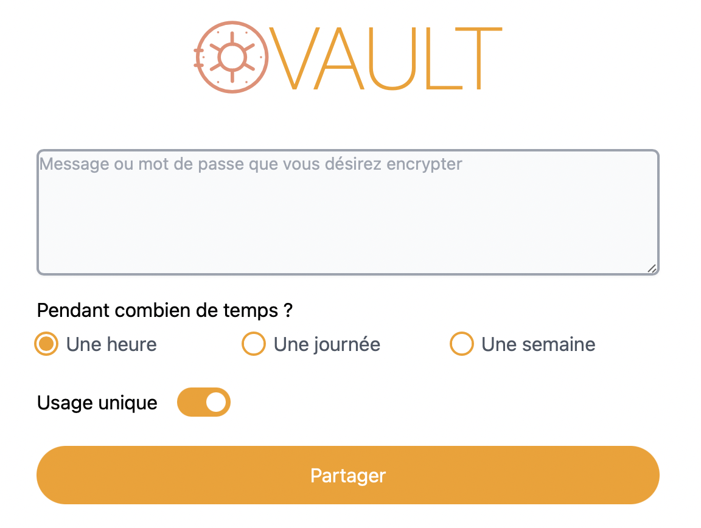

Aki's Vault is a simpler version of the amazing Yopass frontend. This version does not support file uploads or custom decryption key.



## Getting Started

First, install dependencies and run the development server:

```bash
yarn install
yarn start
```

Open [http://localhost:3000](http://localhost:3000) with your browser to see the result.

## Environment variables

You must define an environment variable to specify where the backend server is located.

Create an `.env.local` at the root of this project and define your variable :

```
REACT_APP_BACKEND_URL="http://127.0.0.1:1337"
```

Of course, replace the URL with your Yopass Server Backend URL.

## Build

Simply run the command bellow to build the frontend with React.

```bash
yarn build
```

A new `build` directory has now appeared, it's an static export of the react app, you can place it whereever you want.


