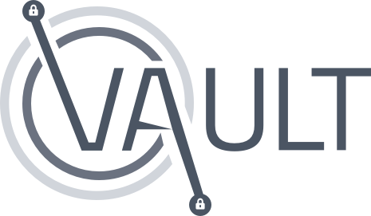

Aki's Vault is a simpler version of the amazing Yopass frontend. This version does not support file uploads or custom decryption key.

The sole purpose of Yopass is to minimize the amount of passwords floating around in ticket management systems, Slack messages and emails. The message is encrypted/decrypted locally in the browser and then sent to yopass without the decryption key which is only visible once during encryption, yopass then returns a one-time URL with specified expiry date.



## Getting Started

First, install dependencies and run the development server:

```bash
cd ~
git clone https://github.com/Akiletour/aki-vault.git
cd aki-vault
yarn install
yarn start
```

Open [http://localhost:3000](http://localhost:3000) with your browser to see the result.

## Environment variables

You must define an environment variable to specify where the backend server (e.g. yopass-server) is located.

Create an `.env.local` at the root of this project and define your variable :

```
REACT_APP_BACKEND_URL="https://vault.your-company.fr/backend"
```

Of course, replace the URL with your Yopass Server Backend URL.

You can check the section `Nginx configuration` if you want to hide the backend url from the public.

### Language

the `src/translations` folder contains all available translations. You can set the language of your application by setting a custom environment variable in `.env.local` as below :

```
REACT_APP_LANG="en_US"
```

By default, the application will load the en_US language.

### Port
the default listen port for the react app is 3000. You can freely modify it in `.env.local` as follow :

```
PORT=2999
```

## Build

Simply run the command bellow to build the frontend with React.

```bash
yarn build
```

A new `build` directory has now appeared, it's an static export of the react app, you can place it anywhere you want, e.g. `/path/to/vault-build`.

## Nginx configuration

You should not expose your backend URL, so you can easily create a nginx vhost configuration to serve both static files and proxy to the backend :

```nginx
server {
	listen 443 ssl http2;
	listen [::]:443 ssl http2;
	server_name vault.your-company.fr;
	
	ssl_certificate ...;
	ssl_certificate_key ...;
	... other ssl stuff ...;

	root /path/to/vault-build;
	index index.html;
	location / {
		try_files $uri $uri/ =404;
	}
	location /backend/ {
		proxy_pass http://127.0.0.1:1337/;
	}
}
```


## Build and install yopass-server
This repo is not designed to provide support on yopass solution, this is just given as example and reminder
(on Debian 11)
golang >= 2.15 is required to build
```bash
sudo apt-get install golang
cd ~
git clone https://github.com/jhaals/yopass.git
cd yopass
go build ./cmd/yopass-server
sudo mv yopass-server /usr/local/bin/
```
### Create systemd and config files
[read the official doc](https://github.com/jhaals/yopass#installation--configuration) for all options
```
cd ~/aki-vault
sudo cp example/server/yopass-default-config /etc/default/yopass-server
sudo cp example/server/yopass.service /etc/systemd/system/yopass.service
sudo systemctl daemon-reload
sudo systemctl enable yopass.service
sudo systemctl start yopass.service
```

Remember, you should have memcached or redis service to run yopass. Provided example listen 127.0.0.1:1337 and uses memcached (on default 127.0.0.1:11211).
